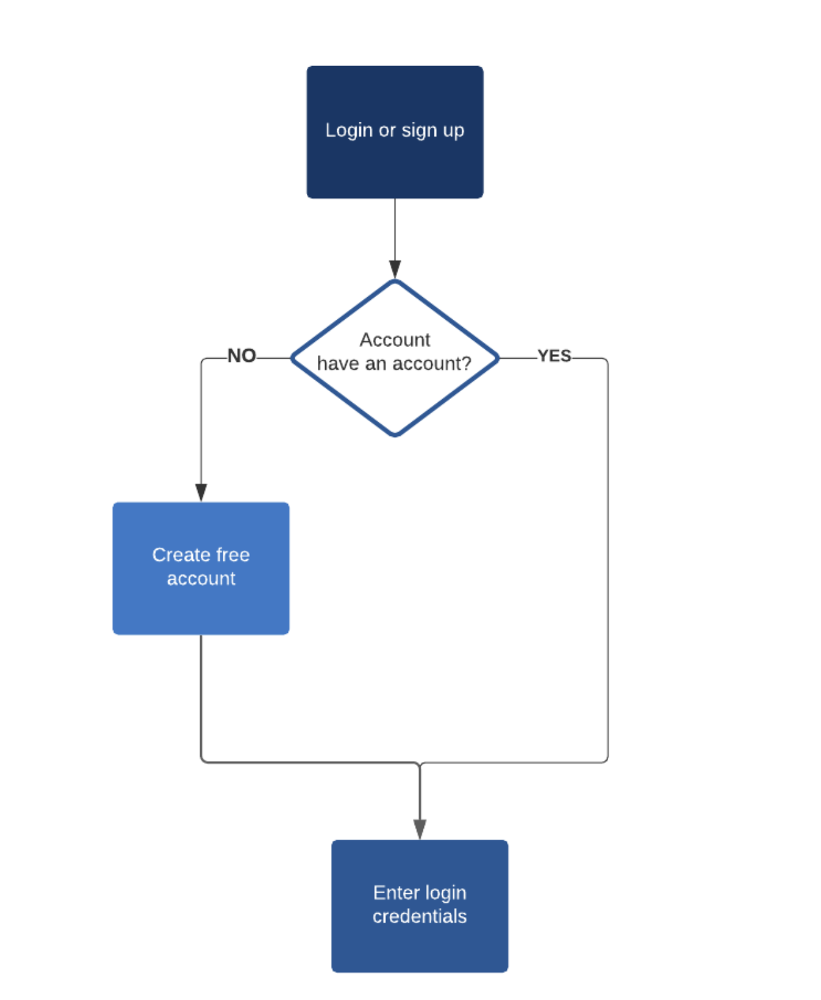
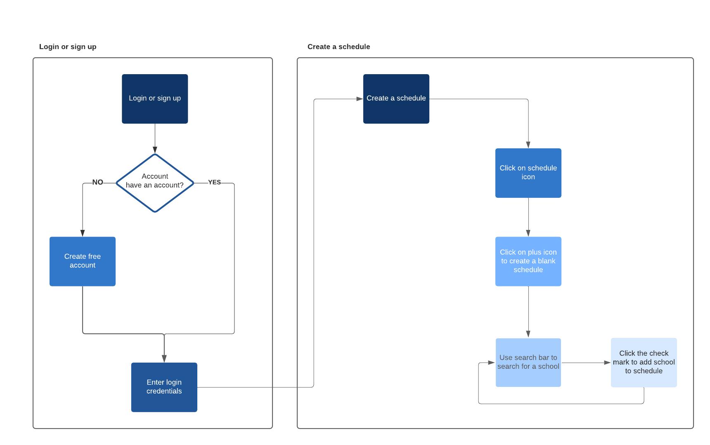
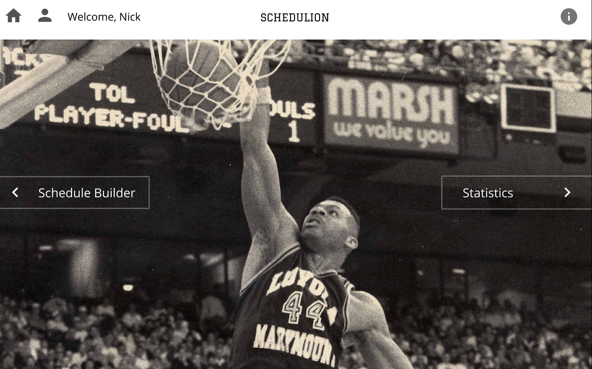
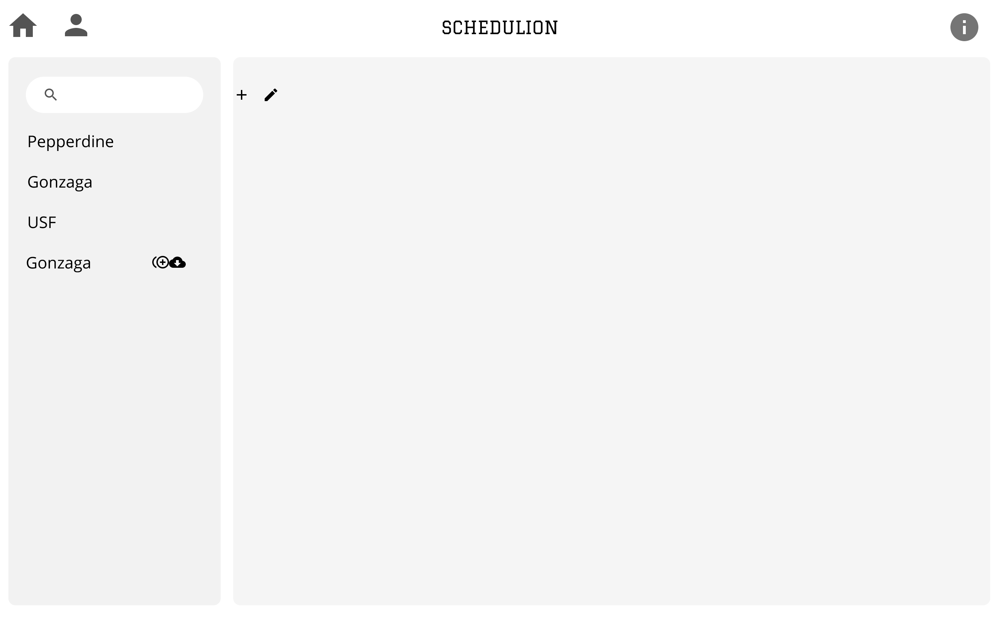
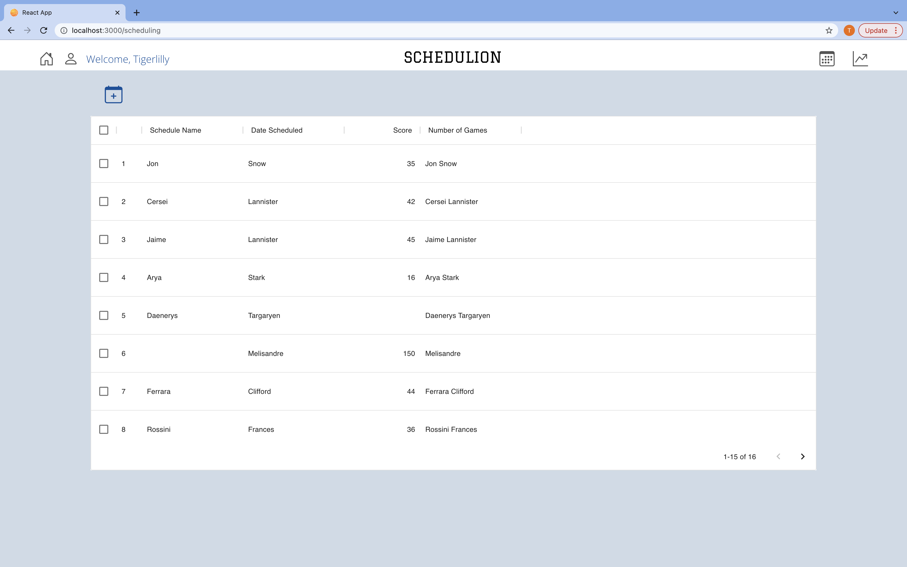
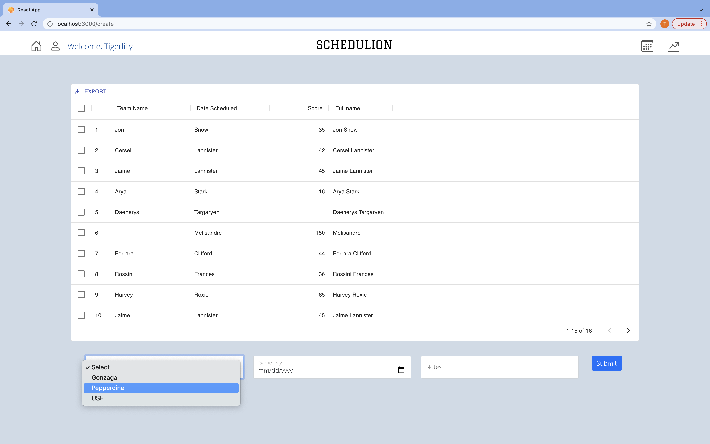

# Project Overview

## Project Name:

ScheduLion

## Project Description:

- LMU's athletic director, Craig Pintens, has approached us with a fascinating data problem: devising a system that can construct / assist them in constructing the best schedule of opponent teams for the basketball season as a function of the team's RPI (rating percentage index), special features constructed by the coaching team, and raw data provided by services like KenPom.

- The problem: the formula used to compute RPI is not public knowledge, schedules must take into account opponents with a good ratio of RPI and likelihood of defeat, and a number of other features that will constitute the model like coaching styles and what constitutes a good "matchup."

- The solution: ScheduLion, which will be used by the LMU Athletics Department to construct next year's schedule, to score opponents based on the above with the goal of constructing a schedule with the highest expected RPI increase for LMU.

- This is a quintessential CS project: optimization meets probability meets constraint satisfaction (algorithms and AI fans unite)!

## Project Justification:

- Automate a tedious task previously done by-hand and prone to human-error

- Provide LMU’s basketball department with the resources to produce a schedule conducive to wins

- Schedule games that ensure a strong strength of schedule by calculating the complex NET score

- A passion for basketball and a passion for LMU

- Go Lions!

## Product, Technical, and Design Documentation:

- User work flow diagram to log in or sign up
  

- User work flow diagram to log in or sign up and create a new schedule 
  

- Architecture/Tech Stack Diagram
  

- Previous experience using many of the technologies we used in our previous classes

- Technologies help with rapid development and implementation, as well as, allowing for future scalability.

- We are using emerging industry standard frameworks and libraries that will continue to develop allowing for room for future growth.
  
#### Figma Design Prototype
- Landing Page

- Login Page

- Home Page

- Scheduler

#### Current Application Update
- This serves as an update of our current React Application, hosted locally on our machines that utilizes placeholder mockdata.
- Landing Page

- Home Page

- Schedule Dashboard

- Create New Schedule

## Product Scope:

- Form a model that produces the NET value, given the variables, past schedules, and raw data

- Produce a model that assigns a score to each opponent and computes strength of schedule for a given schedule

- A desktop application and schedule building platform to allow the LMU Athletics Department to login and create schedules conducive to wins

## Team Members and Roles:

- Joey Ortiz

  - (Artificial Intelligence/Machine Learning)

- Nick Morgan

  - (Artificial Intelligence/Machine Learning/Backend Engineer)

- Andrew Seaman
  - (Artificial Intelligence/Machine Learning/Backend Engineer)

- Tigerlilly Zietz

  - (Frontend Engineer)

## Product Installation Guide:

1. Go to ScheduLion's domain, soon-to-be `schedulion.lmucs.io`.

## Improvement Plan:
- Improve security and add user authentication 
  - To create a safe and secure application for our users and keep their sensitive information private and encyrpted. 
- Get specific user feedback from Craig Pintens
  - To get a more comprehensive understanding for what would serve as the most helpful and practical applcation for schedule-building.
- Understand how coaching features form the scheduling model
  - To get a clear understanding of edge cases that could impact our model as well as account for any aspects of schedule building that machine learning and artifical intelligence is not capable of handling. 
- Improve and simplify the UI work flow
  - To create an application that is complex enough to handle schedule building, dynamic scoring, and data/statistical visualization yet simple enough in design to offer a smooth and consistent user experience. 
- Deploy our application so we can get a head start on user testing
  - To scope out any potential errors and allow users to begin using our app and providing critical feedback early in the design process. 

## Important Resources:

[KenPom](https://kenpom.com/)

## Appendix:

[Agile Board Link](https://schedulion.atlassian.net/jira/your-work)

[GitHub Link](https://github.com/nmorgan8/schedulion)

[Project Proposal Presentation](https://docs.google.com/presentation/d/14l8FbzU_ilYNwes7Dcoq9j5gQoFgduhBUJOkaZMJr-Q/edit#slide=id.p)

[Final Presentation](https://docs.google.com/presentation/d/1iAR3d8UCkqbvBrDlfaypDnwispHEvt8xk2MPZcGeFvg/edit?usp=sharing)
